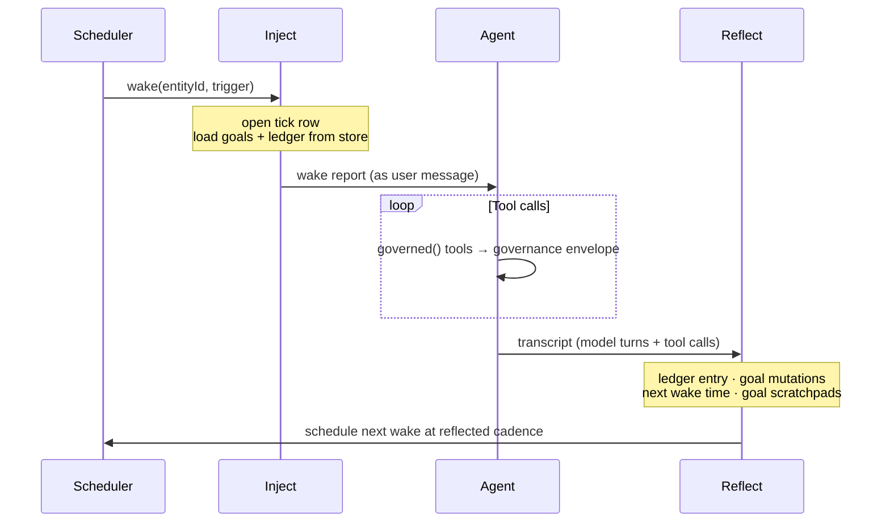

`proactive()` wraps your agent in a loop. Each wake runs the same four phases — inject, run, reflect, schedule — on top of a set of primitives (a scheduler, a heartbeat, a goal store, and the governance envelope) that share one store. This page covers the lifecycle, how work is scoped, and what the SDK guarantees.

## The wake lifecycle



### Inject

The store is read, the tick row is opened, and a report is assembled and delivered to the agent as its opening user message. This message is the [wake report](/concepts/context-injection): standing goals with their `findings` scratchpads, recent wakes (default 5) with every governed action's `target → outcome`, and a fixed behavioral contract. It is judgment-free — facts in, judgment stays with the agent.

Writes: a tick row with status `running`.

### Run

Your unchanged agent executes. Tools wrapped with `governed()` route through the governance envelope; everything else runs untouched. The transcript is recorded live by the adapter (LangChain callbacks for LangGraph; a `Proxy` over `messages.create` for Anthropic).

Reads: nothing from the store beyond what inject loaded. Writes: an attempt row in `proactivity_attempts` for every governed tool dispatch, each carrying its outcome regardless of whether the action ran.

### Reflect

One structured-output call on your `reflection.model` reads the full transcript and produces four things:

1. **`ledgerEntry`** — a paragraph for the agent's future self: what it observed, did, and deliberately skipped.
2. **`goalMutations[]`** — lifecycle changes and `findings` scratchpad updates for any goal.
3. **`nextWakeMinutes`** — how long to wait before the next wake.
4. **`nextWakeReasoning`** — the reasoning behind that choice, stored on the tick row and shown in the next wake's report.

Output is treated as hostile: the schema is enforced provider-side and re-validated locally; cadence is clamped to `{ min, max }`; pinned goals are shielded; invalid mutations are dropped individually. A failed reflection does not fail the wake — it degrades to safe defaults and writes the reason into the ledger entry. `acted` is derived from the attempt rows, not from what the model claims. See [Reflection](/concepts/reflection).

### Schedule

The scheduler is re-armed at the cadence reflection chose (clamped within `{ min, max }`) and the tick row is closed as `completed`. If `report.summarizeOlderWakes` is on and wakes have aged out of the recent window, a fold call runs post-wake to maintain the [rolling summary](/concepts/memory).

## Entity model

One loop per `entityId`. An entity is whatever you scope a loop to — a GitHub repo, a customer workspace, a user. Multi-tenant operation means many entities on one handle:

```ts
await handle.start("acme/api");     // one loop
await handle.start("acme/billing"); // second independent loop, same config
```

Each entity's state, goals, and ledger are isolated in the store under its `entityId`.

## Triggers

| Trigger | How |
|---|---|
| `scheduled` | Normal timer or BullMQ firing |
| `manual` | `handle.wake(entityId)` — an immediate wake from outside the loop (webhooks, user actions) |
| `skipped` | `shouldWake` returned false — tick recorded, wake count incremented, clock re-arms |

## Failure surfaces

| What fails | Where it lands |
|---|---|
| Agent throws during run | Tick recorded as `failed`; `onError` called; next wake scheduled at `cadence.default` |
| Reflection throws | Degraded to safe defaults; reason written into ledger; wake still completes |
| Observer (`observe` fn) throws | Swallowed — observer errors never propagate to the wake |
| Scheduled-wake infrastructure error | `onError` called; the tick records its own failure |
| Ledger fold fails | `onError` called; fold marker not advanced; next wake retries the fold |

## Two-layer design

`proactive()` is compiled from documented, individually usable primitives: a scheduler, a heartbeat, a goal store, and the governance envelope, all sharing one store. The wrapper is the default layer; the primitives are the layer beneath it.

When the wrapper's shape doesn't fit a flow, you can use the primitives directly — same tables, same ledger, same scheduler. Dropping down is not a migration: your data, audit history, and guarantees carry over unchanged. In exchange you take ownership of the briefing and cadence logic the wrapper otherwise handles. See [Use the primitives directly](/guides/primitives).

## Invariants

A few things hold regardless of configuration. They are not missing knobs — they are what makes the loop behave predictably when it runs unattended.

| Invariant | Rationale |
|---|---|
| Reflection always runs | The ledger, goal scratchpads, and cadence all come from reflection. A failed call degrades to safe defaults; it never skips. |
| `pinned` can never be set by model output | Pinned goals are developer-declared. Reflection may evolve their scratchpads and reprioritize them — not complete, pause, or archive them. That authority stays with `handle.completeGoal()`. |
| Idempotency is claimed before the effect | Crash-safe dedupe requires the key to be claimed before the side effect runs, not after. |
| The report carries no judgment | `shouldWake` may only skip a wake, never pre-digest what matters. The report is facts. |
| Observers can never fail a wake | A throwing observer is swallowed. The wake does not abort because a logger threw. |

## Related

- [Scheduling](/concepts/scheduling) — how cadence, `wake()`, and `shouldWake` work
- [Reflection](/concepts/reflection) — the reasoning step in detail
- [Events reference](/reference/events) — the observable event stream
