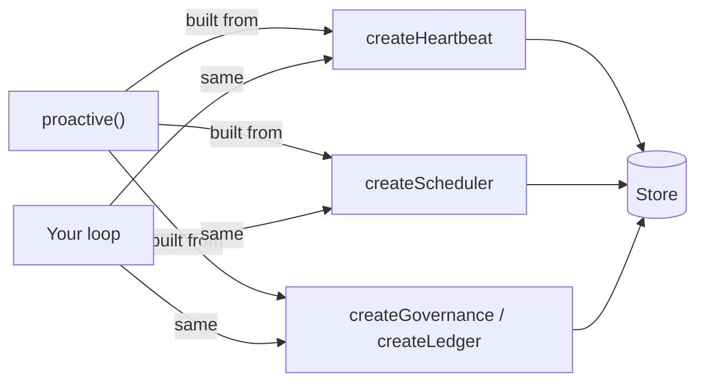

`proactive()` is compiled from four documented, individually usable primitives sharing one store. Use this layer when you want to own the loop yourself: custom tick logic, your own briefing sources, plan/act splits, or a wake pipeline that doesn't fit the wrapper's shape.

Ejecting one layer down is not a migration: same tables, same ledger, same scheduler.

<Note>
  Dropping to the primitives means giving up the wrapper's inject and reflect phases. You own briefing assembly and the cadence decision — the tick function returns its own `cadenceHint`, and there is no automatic ledger entry or goal-scratchpad update unless you write one. The store, governance envelope, and scheduler are unchanged.
</Note>



## The four primitives

### `createScheduler`

The clock. Wakes the agent and re-arms itself after each wake.

```ts
import { createScheduler } from "@refix/proactivity";
import { createBullMQAdapter } from "@refix/proactivity/bullmq";

const scheduler = createScheduler({
  adapter: createBullMQAdapter({
    queueName: "heartbeats",
    connection: { host: "localhost", port: 6379 },
  }),
  store,
  cadence: { min: 15 * 60_000, max: 24 * 60 * 60_000, default: 24 * 60 * 60_000 },
  identity: (entityId) => `heartbeat:${entityId}`,
  onTick: (entityId, trigger) => heartbeat.runTick(entityId, trigger),
});

await scheduler.start("entity-1");
```

Failures auto-recover: a `null` cadence hint defaults to `cadence.default`; `seedFromStore()` re-enqueues missed jobs on restart.

### `createHeartbeat`

One tick. Gathers context from briefing sources, loads goals, and hands both to your tick function.

```ts
import { createHeartbeat, createTestStore } from "@refix/proactivity";
import { createTimerAdapter } from "@refix/proactivity/timer";

const store = createTestStore();

const heartbeat = createHeartbeat({
  store,
  cadence: { min: 15 * 60_000, max: 24 * 60 * 60_000, default: 60 * 60_000 },
  sources: [
    { name: "newSignups", load: async (boundary) => db.signups.since(boundary.deltaCutoff) },
    { name: "openTickets", load: async () => db.tickets.where({ status: "open" }) },
  ],
  governance: { store, caps: { perPass: 3, perTick: 10 } },
  tick: async ({ briefing, goals, governance, boundary }) => {
    const newSignups = briefing.newSignups as string[];
    if (!newSignups.length) {
      return { cadenceHint: { nextTickMs: 4 * 60 * 60_000, reasoning: "quiet, back off" } };
    }

    const goal = goals[0];
    if (!goal) return { cadenceHint: { nextTickMs: 60 * 60_000, reasoning: "no goals yet" } };

    const goalTickId = await store.insertGoalTick({
      goalId: goal.id,
      tickId: boundary.tickId,
      orderIndex: 0,
    });

    for (const userId of newSignups) {
      await governance.dispatch({
        goalId: goal.id,
        goalTickId,
        actionType: "send_email",
        target: { userId },
        reasoning: `Welcome email for ${userId}`,
        perform: async () => { await mailer.send(userId); },
      });
    }

    return { cadenceHint: { nextTickMs: 15 * 60_000, reasoning: "activity, stay close" } };
  },
});
```

Each briefing source receives a `BriefingBoundary` with a `deltaCutoff` timestamp marking what is new since the last tick. Sources run in parallel.

### `createGovernance` + `createLedger`

The safety envelope. Used directly inside your tick. See [Governance](/concepts/governance) for outcome semantics.

```ts
import { createGovernance, createLedger } from "@refix/proactivity";

// Typically obtained from the heartbeat tick context:
const { governance } = tickContext;

// Or build directly for custom tick logic:
const ledger = createLedger();
const governance = createGovernance(
  { store, caps: { perPass: 3, perTick: 10 } },
  tickId,
  entityId,
  ledger,
);
```

### `createPlanActHeartbeat`

Plan/act split for complex agents: a planner mutates goals and selects which to work on; an executor works on one goal at a time.

```ts
import { createPlanActHeartbeat } from "@refix/proactivity";

const heartbeat = createPlanActHeartbeat({
  store,
  cadence: { min: 15 * 60_000, max: 24 * 60 * 60_000, default: 60 * 60_000 },
  governance: { store, caps: { perPass: 3, perTick: 10 } },
  planner: async ({ briefing, goals }) => ({
    goalMutations: [
      {
        op: "create",
        title: "Follow up with inactive users",
        objective: "...",
        doneCondition: "...",
        reasoning: "New signal detected",
      },
    ],
    selectedGoals: [{ goalId: "goal-1", reasoning: "Highest priority" }],
    skippedGoals: [],
    cadenceHint: { nextTickMs: 30 * 60_000, reasoning: "Active signals" },
  }),
  executor: async ({ goal, goalTickId, governance }) => {
    await governance.dispatch({
      goalId: goal.id,
      goalTickId,
      actionType: "send_follow_up",
      target: { goalId: goal.id },
      reasoning: "Following up on this goal",
      perform: async () => { /* ... */ },
    });
    // Whether the pass acted is derived from the audit trail, not from here.
    return { summary: "Sent follow-up" };
  },
});
```

## Prompt builders

`@refix/proactivity/prompts` exports prompt builders for the primitives layer:

| Export | For |
|---|---|
| `buildTickPrompt(ctx)` | General tick function |
| `buildPlannerPrompt(ctx)` | Plan/act planner step |
| `buildExecutorPrompt(ctx)` | Plan/act executor step |

These produce prompts in the same style as the wrapper layer. You're not required to use them — assemble your own if you prefer.

## Related

- [Architecture](/concepts/architecture) — the two-layer design and how the wrapper compiles down
- [`PRIMITIVES.md`](https://github.com/refixai/proactivity/blob/main/PRIMITIVES.md) — the full in-repo primitives reference
- [Primitives reference](/reference/primitives) — the export map
